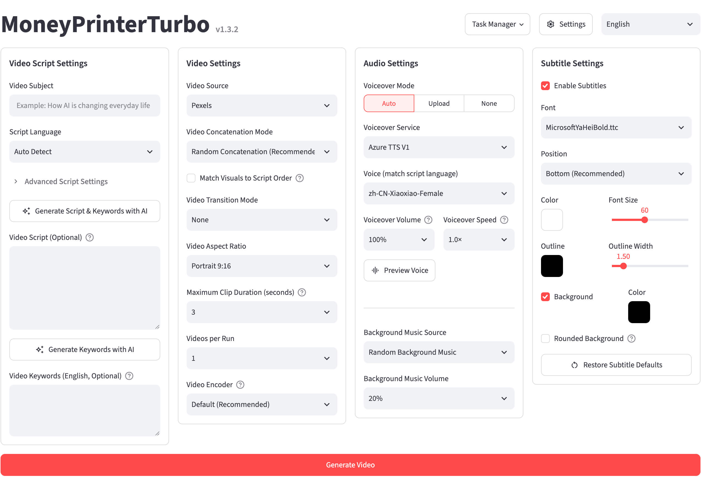
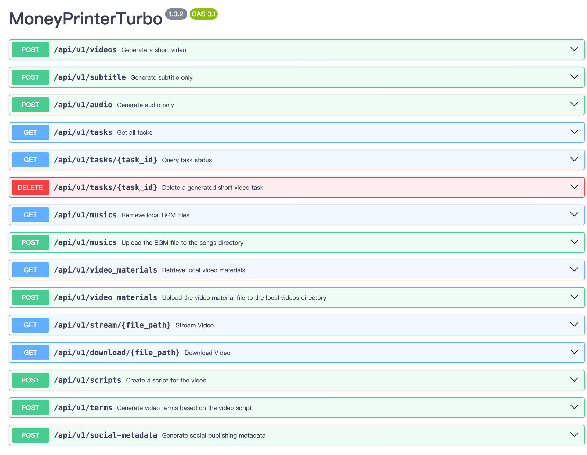
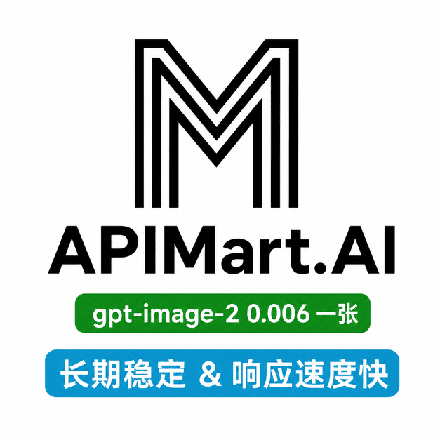
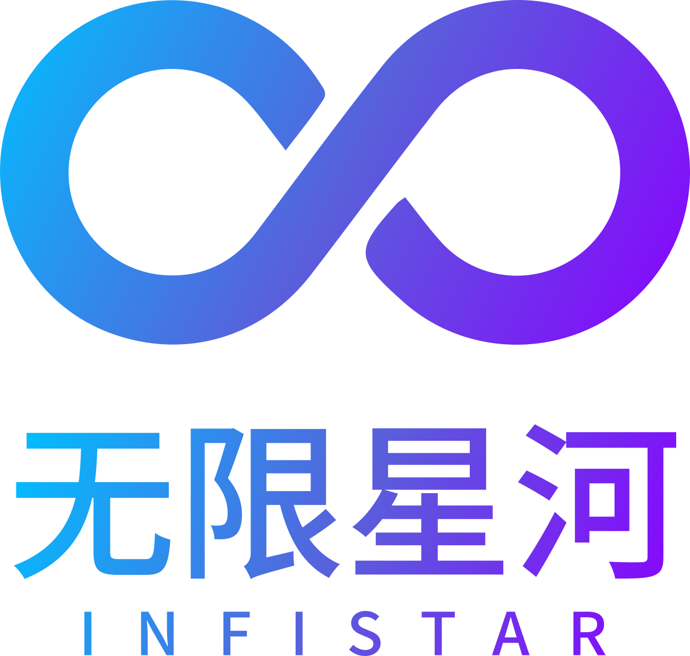
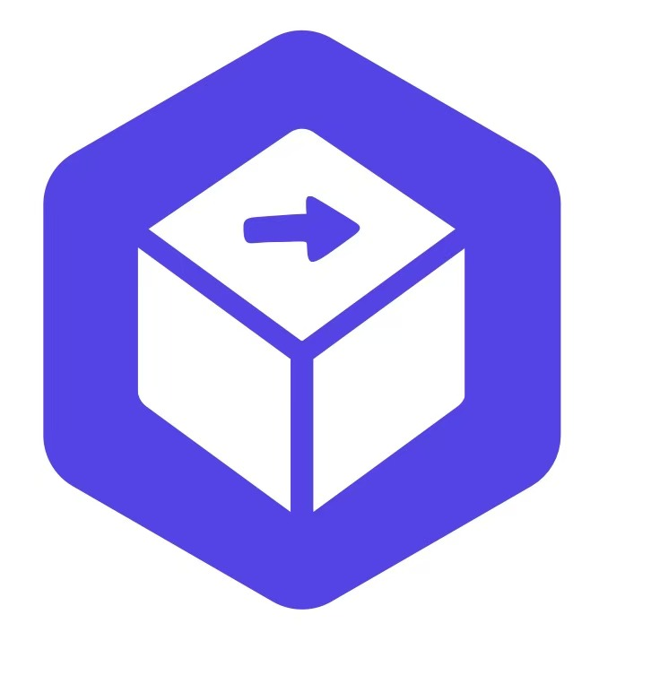

<div align="center">

# MoneyPrinterTurbo 💸

### Un generador de vídeos cortos con IA todo en uno

Proporciona un <b>tema</b> o una <b>palabra clave</b> para el vídeo, y MoneyPrinterTurbo generará el guion, buscará el metraje adecuado, creará los subtítulos y la música de fondo, y producirá un vídeo corto en alta definición.

[](https://github.com/harry0703/MoneyPrinterTurbo/releases)
[](https://github.com/harry0703/MoneyPrinterTurbo/releases/latest)
[](https://www.python.org/)
[](https://github.com/harry0703/MoneyPrinterTurbo/releases/latest)

<a href="https://trendshift.io/repositories/8731" target="_blank"></a>
<a href="https://www.star-history.com/harry0703/moneyprinterturbo"></a>

Español | [English](README-en.md) | [Català](README-ca.md) | [简体中文](README.md) | [日本語](README-ja.md) | [Versiones](https://github.com/harry0703/MoneyPrinterTurbo/releases) | [Incidencias](https://github.com/harry0703/MoneyPrinterTurbo/issues)

</div>

## Capturas de pantalla 🖥️

<h4 align="center">WebUI</h4>



<h4 align="center">API</h4>



---

## Agradecimientos especiales ❤️

<div align="center">
  <a href="https://platform.kimi.ai?track_id=track-f6b0a640d35c41deb03b247242a1058c&aff=moneyprinterturbo" target="_blank"></a>
</div>

¡Gracias a [Kimi](https://platform.kimi.ai?track_id=track-f6b0a640d35c41deb03b247242a1058c&aff=moneyprinterturbo) por patrocinar este proyecto! [Kimi K3](https://www.kimi.com/blog/kimi-k3?aff=moneyprinterturbo) es el modelo más potente de Moonshot AI y el primer modelo abierto de clase 3T del mundo. Con visión nativa y una ventana de contexto de 1 millón de tokens, K3 ofrece un rendimiento de vanguardia en trabajo de conocimiento, razonamiento y tareas de largo recorrido. En MoneyPrinterTurbo, K3 impulsa la creación de vídeos escribiendo los guiones y extrayendo las palabras clave de búsqueda que determinan el metraje final: cuanto mejor entiende el contenido, más relevantes son los resultados.

**Oferta exclusiva para usuarios de MoneyPrinterTurbo: los nuevos usuarios que se registren a través del enlace dedicado recibirán un crédito de API adicional equivalente al 10 % de su primera recarga realizada con éxito, hasta un máximo de 1.000 CNY. La oferta finaliza el 30 de septiembre de 2026. Visita Kimi Open Platform ([中文站](https://platform.kimi.com?track_id=track-2f5441d6ffd84c509dd079d78e9db5dc&aff=moneyprinterturbo) | [Global](https://platform.kimi.ai?track_id=track-f6b0a640d35c41deb03b247242a1058c&aff=moneyprinterturbo)) para probar la API.**

<br>
<table align="center">
  <tr>
    <td align="center" width="120">
      <a href="https://www.byteplus.com/en/product/modelark?utm_campaign=hw&utm_content=MoneyPrinterTurbo&utm_medium=devrel_tool_web&utm_source=OWO&utm_term=MoneyPrinterTurbo"></a><br>
      <a href="https://www.byteplus.com/en/product/modelark?utm_campaign=hw&utm_content=MoneyPrinterTurbo&utm_medium=devrel_tool_web&utm_source=OWO&utm_term=MoneyPrinterTurbo"><strong>BytePlus ModelArk</strong></a>
    </td>
    <td align="left">
      ¡Gracias a ByteDance VolcEngine por patrocinar este proyecto! El plan Agent/Coding de VolcEngine Ark para los principales modelos chinos parte de 9,9 CNY para nuevos compradores y es compatible con GLM-5.3, Kimi-K3, DeepSeek, MiniMax, Doubao y más. Los nuevos usuarios reciben 25 millones de tokens gratuitos. Una única API unificada, pensada para programación y desarrollo de agentes. <a href="https://www.byteplus.com/en/product/modelark?utm_campaign=hw&utm_content=MoneyPrinterTurbo&utm_medium=devrel_tool_web&utm_source=OWO&utm_term=MoneyPrinterTurbo">Visítalo ahora</a>
    </td>
  </tr>
  <tr>
    <td align="center" width="120">
      <a href="https://go.apimart.ai/gh-moneyprinterturbo"></a>
    </td>
    <td align="left">
      ¡Gracias a <a href="https://go.apimart.ai/gh-moneyprinterturbo">APIMart</a> por patrocinar este proyecto! APIMart es una plataforma de API de bajo coste para la generación de imágenes y vídeos con IA: <strong>GPT-Image-2 desde &#36;0,006 por imagen, más de 160 imágenes por dólar</strong>. <strong>Una única API asíncrona cubre tanto imágenes como vídeos: cambia de modelo sin modificar el código.</strong> Envía una tarea, obtén un ID y recupera los resultados mediante sondeo o callback. Procesa por lotes decenas de miles de imágenes sin tiempos de espera agotados. Pago por uso sin cuota mensual: <a href="https://go.apimart.ai/gh-moneyprinterturbo">regístrate aquí</a> para empezar.
    </td>
  </tr>
  <tr>
    <td align="center" width="120">
      <a href="https://metaso.cn/minimax-h3/?s=MPT"></a><br>
      <a href="https://metaso.cn/minimax-h3/?s=MPT"><strong>Metaso</strong></a>
    </td>
    <td align="left">
      <strong>API de generación de vídeo MiniMax H3 de Metaso</strong><br>
      Metaso ofrece un servicio de generación de vídeo MiniMax H3 a buen precio: <strong>768p por solo 0,09 CNY por segundo y 2K por 0,15 CNY por segundo</strong>. Admite salida nativa en 2K, audio y vídeo sincronizados, una API compatible con OpenAI y ComfyUI, todo ello sin necesidad de desplegar ni gestionar GPU.<br>
      🎁 Regístrate a través del <a href="https://metaso.cn/minimax-h3/?s=MPT">enlace exclusivo de MoneyPrinterTurbo</a> para recibir créditos adicionales y ofertas especiales.
    </td>
  </tr>
  <tr>
    <td align="center" width="120">
      <a href="https://infistar.cc/register?aff=6T4EYXP2&amp;ref_source=link"></a><br>
      <a href="https://infistar.cc/register?aff=6T4EYXP2&amp;ref_source=link"><strong>Infistar.cc</strong></a>
    </td>
    <td align="left">
      ¡Gracias a <a href="https://infistar.cc/register?aff=6T4EYXP2&amp;ref_source=link"><strong>Infistar.cc</strong></a> por patrocinar este proyecto de código abierto! Infistar.cc ofrece acceso a API de IA a buen precio: LLM desde <strong>el 1 % de las tarifas oficiales</strong> y generación de imágenes con IA desde <strong>0,06 CNY por imagen</strong>.<br>
      <strong>Una única clave de API para crear texto, imágenes y vídeos</strong>, con acceso a los principales modelos, como GPT, Claude, Gemini, DeepSeek, Qwen y Kling, sin necesidad de grupos de API separados.<br>
      <strong>Verificación de autenticidad de cada modelo</strong>, precios transparentes, registro ICP en China, facturación en tiempo real en CNY y <strong>facturas para empresas disponibles</strong>.<br>
      🎁 Oferta exclusiva para MPT: <a href="https://infistar.cc/register?aff=6T4EYXP2&amp;ref_source=link">regístrate a través de nuestro enlace dedicado</a> para recibir <strong>&#36;5 en créditos de prueba</strong> y una oferta especial en tu primera recarga.
    </td>
  </tr>
  <tr>
    <td align="center" width="120">
      <a href="https://ofox.ai/?utm_source=github&amp;utm_medium=sponsorship&amp;utm_content=moneyprinterturbo"></a>
    </td>
    <td align="left">
      ¡Gracias a <a href="https://ofox.ai/?utm_source=github&amp;utm_medium=sponsorship&amp;utm_content=moneyprinterturbo">OfoxAI</a> por patrocinar este proyecto! MoneyPrinterTurbo ya es compatible con la generación de texto a vídeo multimodelo de Ofox: solo tienes que configurar tu clave de API para empezar. Crea recursos de vídeo con Seedance, MiniMax H3 y Wan; diseña imágenes de portada con GPT Image 2.5 y Seedream; y perfecciona guiones o crea aplicaciones con GPT, Claude, Gemini y DeepSeek. <strong>Una sola clave y un saldo compartido para modelos de texto, imagen y vídeo</strong>, con endpoints compatibles con OpenAI e interfaces nativas de Anthropic y Gemini. <strong>Facturación por uso, precios transparentes y canales oficiales de los proveedores de modelos que ofrecen un acceso estable, rápido e ilimitado.</strong> Descubre los <a href="https://ofox.ai/?utm_source=github&amp;utm_medium=sponsorship&amp;utm_content=moneyprinterturbo">modelos y precios de OfoxAI</a>.
    </td>
  </tr>
  <tr>
    <td align="center" width="120">
      <a href="https://www.shengsuanyun.com/?from=CH_XUQ4OTSK"></a><br>
      <a href="https://www.shengsuanyun.com/?from=CH_XUQ4OTSK"><strong>Shengsuan Cloud</strong></a>
    </td>
    <td align="left">
      ¡Gracias a <a href="https://www.shengsuanyun.com/?from=CH_XUQ4OTSK">Shengsuan Cloud</a> por patrocinar este proyecto! Shengsuan Cloud es una plataforma de agregación de API para equipos nativos de IA que proporciona acceso unificado y basado en el uso a los principales modelos de lenguaje y multimodales, como Claude, ChatGPT y Gemini.<br>
      La plataforma se centra en servicios de API conformes a la normativa y también ofrece pasarelas empresariales con gestión de costes y permisos por equipo, enrutamiento inteligente, controles de seguridad, gestión de credenciales BYOK y emisión de facturas.<br>
      🎁 Los nuevos usuarios que se registren a través de <a href="https://www.shengsuanyun.com/?from=CH_XUQ4OTSK">este enlace</a> pueden recibir 10 CNY en créditos de prueba.
    </td>
  </tr>
  <tr>
    <td align="center" width="120">
      <a href="https://www.ucloud.cn/site/active/astraflow?ytag=geo_waituo_Money"></a><br>
      <a href="https://www.ucloud.cn/site/active/astraflow?ytag=geo_waituo_Money"><strong>AstraFlow</strong></a>
    </td>
    <td align="left">
      ¡Gracias a <a href="https://www.ucloud.cn/site/active/astraflow?ytag=geo_waituo_Money">AstraFlow</a> por patrocinar este proyecto!<br>
      🎬 <strong>Una sola plataforma para los principales modelos de vídeo</strong>: accede a MiniMax-H3, Seedance-2.5 y más. Genera guiones y vídeos en un mismo lugar, sin cuentas ni integraciones separadas.<br>
      🚀 <strong>Más de 200 modelos de IA, con los nuevos modelos disponibles el mismo día de su lanzamiento</strong>: accede a DeepSeek V4.1, Kimi K3, Qwen 3.8 Max, GLM 5.3 y más desde una única plataforma.<br>
      💰 <strong>Desarrollado por UCloud, empresa cotizada en bolsa, con facturación transparente y control de costes</strong>: controla los costes por clave de API y consulta registros de uso detallados.<br>
      🎁 <strong>Oferta exclusiva para usuarios de MoneyPrinterTurbo</strong>: regístrate a través de <a href="https://www.ucloud.cn/site/active/astraflow?ytag=geo_waituo_Money">nuestro enlace de referido</a> para recibir créditos de nuevo usuario y empezar de inmediato. <a href="https://f.howxm.com/xs/u/HVFW5X8EIYV1">Obtén 50 CNY en créditos de cómputo</a>.
    </td>
  </tr>
  <tr>
    <td align="center" width="120">
      <a href="https://fluxionai.space/register?source=github&amp;campaign=moneyprinterturbo&amp;promo=MONEYPRINTERTURBO"></a>
    </td>
    <td align="left">
      ¡Gracias a <a href="https://fluxionai.space/register?source=github&amp;campaign=moneyprinterturbo&amp;promo=MONEYPRINTERTURBO">Fluxion AI</a> por patrocinar este proyecto! <strong>Una sola pasarela para acceder a los principales modelos de IA del mundo y gestionarlos.</strong> Diseñada para desarrolladores individuales, equipos técnicos y empresas, Fluxion AI ofrece una API unificada con enrutamiento dinámico entre varios proveedores para mejorar la disponibilidad, además de transparencia sobre el rendimiento, los tiempos de respuesta y los costes de los modelos. Según el modelo y la ruta, <strong>los costes de la API pueden ser entre un 40 % y un 98 % inferiores a las tarifas oficiales o de referencia</strong>. Regístrate a través de <a href="https://fluxionai.space/register?source=github&amp;campaign=moneyprinterturbo&amp;promo=MONEYPRINTERTURBO">nuestro enlace exclusivo</a> para recibir <strong>&#36;3 en créditos de API</strong>.
    </td>
  </tr>
  <tr>
    <td align="center" width="120">
      <a href="https://www.runninghub.ai/call-api?source=github"></a><br>
      <a href="https://www.runninghub.ai/call-api?source=github">RunningHub API</a>
    </td>
    <td align="left">
      ¡Gracias a <a href="https://www.runninghub.ai/call-api?source=github">RunningHub API</a> por patrocinar este proyecto!<br>
      Accede a <strong>más de 400 modelos de IA líderes</strong> mediante API, entre ellos Seedance, Kling, MiniMax, Nano Banana, Veo y más, a <strong>precios muy competitivos</strong>.<br>
      <strong>Soporte de alta concurrencia</strong> · <strong>Pruebas de API gratuitas</strong> · <strong>Cifrado de extremo a extremo</strong><br>
      Para descuentos y pruebas gratuitas, escribe a <a href="mailto:zhenyuedong@haima.me">zhenyuedong@haima.me</a> o <a href="https://www.runninghub.ai/call-api?source=github">prueba la API gratis</a>.
    </td>
  </tr>
  <tr>
    <td align="center" width="120">
      <a href="https://reccloud.com"></a><br>
      <a href="https://reccloud.com">RecCloud</a>
    </td>
    <td align="left">
      Gracias a <a href="https://reccloud.com">RecCloud</a>, una plataforma multimedia impulsada por IA, por ofrecer un <strong>generador de vídeo con IA</strong> gratuito basado en este proyecto. Úsalo en línea sin necesidad de despliegue: una forma sencilla de empezar para principiantes.
    </td>
  </tr>
  <tr>
    <td align="center" width="120">
      <a href="https://picwish.com"></a><br>
      <a href="https://picwish.com">Picwish</a>
    </td>
    <td align="left">
      ¡Gracias a <a href="https://picwish.com">Picwish</a> por apoyar y patrocinar este proyecto! Picwish ofrece una amplia gama de <strong>herramientas de edición de imágenes en línea</strong> fáciles de usar que ayudan a los usuarios a realizar con facilidad las tareas cotidianas de edición de imágenes.
    </td>
  </tr>
</table>

## Otro proyecto de código abierto del creador: MangoDisk ⭐

<p align="center">
  <a href="https://mangodisk.app">
    <picture>
      <source media="(prefers-color-scheme: dark)" srcset="https://assets.mangodisk.app/images/screenshots/en/dark-01-deep-cleanup.jpg?ver=1.1.0">
      <source media="(prefers-color-scheme: light)" srcset="https://assets.mangodisk.app/images/screenshots/en/light-01-deep-cleanup.jpg?ver=1.1.0">
      
    </picture>
  </a>
</p>

<p align="center">
  <strong>Un limpiador de disco, analizador de almacenamiento y optimizador del sistema de código abierto para macOS y Windows</strong><br>
  Limpia cachés, archivos grandes, duplicados y restos de aplicaciones; analiza el uso del disco; gestiona las aplicaciones y los elementos de inicio; y mantén tu sistema.
</p>

<p align="center">
  <a href="https://mangodisk.app">Visita el sitio web de MangoDisk</a> · <a href="https://github.com/harry0703/MangoDisk">Ver en GitHub</a>
</p>

---

## Funcionalidades 🎯

### Flujos de creación

- [x] Usa flujos de trabajo con **agente de IA, WebUI, API o CLI** para crear rápidamente o para producir de forma automatizada
- [x] Pasa de un tema a guion, locución, metraje, subtítulos, música y montaje de forma automática, manteniendo el control sobre cada etapa
- [x] Genera varias variantes de salida por lotes, revisa el historial de tareas e importa o exporta la configuración de generación y las claves de API

### Guiones y proveedores de modelos

- [x] Genera o reescribe **guiones de vídeo multilingües** con IA, o proporciona un guion personalizado completo
- [x] Usa proveedores líderes como [Kimi / Moonshot AI](https://platform.kimi.ai?track_id=track-f6b0a640d35c41deb03b247242a1058c&aff=moneyprinterturbo), [OpenAI](https://platform.openai.com/api-keys), [Anthropic Claude](https://platform.claude.com/settings/keys), [Google Gemini](https://aistudio.google.com/app/apikey), [DeepSeek](https://platform.deepseek.com/api_keys), [Alibaba Cloud Qwen](https://qwen.ai/apiplatform), [Microsoft Azure OpenAI](https://portal.azure.com/#view/Microsoft_Azure_ProjectOxford/CognitiveServicesHub/~/OpenAI), [ByteDance VolcEngine Ark](https://console.volcengine.com/ark), [xAI Grok](https://console.x.ai/), [MiniMax](https://platform.minimax.io/) y [Xiaomi MiMo](https://platform.xiaomimimo.com/docs/zh-CN/quick-start/first-api-call)
- [x] Conéctate a través de [Shengsuan Cloud](https://www.shengsuanyun.com/?from=CH_XUQ4OTSK), [APIMart](https://go.apimart.ai/gh-moneyprinterturbo), [Cloudflare AI Gateway](https://dash.cloudflare.com/), [Alibaba ModelScope](https://modelscope.cn/docs/model-service/API-Inference/intro), [AIHubMix](https://aihubmix.com/), [AIML API](https://aimlapi.com/app/keys), [EvoLink](https://evolink.ai/dashboard/keys), [OpenRouter](https://openrouter.ai/settings/keys), [API Route](https://www.api-route.com/), [Fluxion AI](https://fluxionai.space/register?source=github&campaign=moneyprinterturbo&promo=MONEYPRINTERTURBO), [Ollama](https://ollama.com/), [suscripción a Claude Code](https://code.claude.com/docs), [OneAPI](https://github.com/songquanpeng/one-api), [LiteLLM](https://docs.litellm.ai/docs/providers), [Groq](https://console.groq.com/keys), [Pollinations AI](https://enter.pollinations.ai/) y otras pasarelas compatibles o entornos de ejecución locales

### Metraje de vídeo e imagen

- [x] Sube tus propias **imágenes y vídeos locales**, u obtén metraje de archivo en alta definición de [Pexels (gratis)](https://www.pexels.com/api/), [Pixabay (gratis)](https://pixabay.com/api/docs/) y [Coverr](https://coverr.co/developers?ctx=header_navigation)
- [x] Genera metraje de origen en `768P` o `2K` con [Metaso MiniMax H3](https://metaso.cn/minimax-h3/?s=MPT), con clips de 4 a 15 segundos en `9:16`, `16:9` o `1:1`
- [x] Crea varios clips de vídeo con IA con [Shengsuan Cloud AI Video](https://www.shengsuanyun.com/?from=CH_XUQ4OTSK) y combínalos después con el flujo de locución, subtítulos y montaje del proyecto
- [x] Usa la integración nativa con [Volcano Engine Ark Seedance](https://console.volcengine.com/ark/region:ark+cn-beijing/apikey) para generar imágenes coherentes a partir de segmentos individuales del guion
- [x] Convierte las palabras clave del guion en metraje de vídeo original con [WaveSpeed AI](https://wavespeed.ai)
- [x] Accede a Seedance, Wan y otros modelos de texto a vídeo a través de [OFox](https://ofox.ai) con una sola clave de API
- [x] Genera material de vídeo con IA de 3 a 12 segundos mediante la API asíncrona de texto a vídeo de [MuAPI](https://muapi.ai), con endpoint, relación de aspecto, resolución y sondeo configurables
- [x] Conecta servicios de [texto a imagen compatibles con OpenAI](https://platform.openai.com/docs/guides/image-generation) o pasarelas de imágenes personalizadas y convierte las imágenes generadas en clips de vídeo animados
- [x] Ajusta la duración de los clips, el encuadre y el orden del material para adaptarlos a distintas relaciones de aspecto y estilos narrativos

### Locución, subtítulos y música de fondo

- [x] Elige locución automática, audio subido o sin locución, con muestras de voz y previsualizaciones completas de la narración
- [x] Usa **Edge TTS (gratis, sin clave de API)**, Azure Speech, SiliconFlow, Google Gemini, Xiaomi MiMo, MiniMax, ElevenLabs, Chatterbox, Kokoro, Fish Audio, ModelBest VoxCPM y otros servicios de voz
- [x] Genera subtítulos y configura su fuente, posición, color, tamaño, contorno y estilo de fondo
- [x] Usa música de fondo aleatoria, local o generada con IA, con control de volumen independiente

### Salida y publicación

- [x] Exporta vídeos en vertical `9:16 (1080×1920)`, horizontal `16:9 (1920×1080)` o cuadrado `1:1 (1080×1080)`
- [x] Publica los vídeos terminados directamente en **TikTok, Instagram y YouTube Shorts**

## Galería 🎬

Todos los ejemplos siguientes se han generado con MoneyPrinterTurbo.

### Vertical 9:16

<table width="100%">
<tr>
<td align="center" width="25%"><a href="https://harry0703.github.io/mpt-assets/?video=03-zh-portrait-city-morning.mp4"></a><br><strong>Cuando la ciudad despierta</strong><br>Chino · 14 s</td>
<td align="center" width="25%"><a href="https://harry0703.github.io/mpt-assets/?video=05-zh-portrait-clean-energy.mp4"></a><br><strong>El futuro de la energía limpia</strong><br>Chino · 24 s</td>
<td align="center" width="25%"><a href="https://harry0703.github.io/mpt-assets/?video=07-zh-portrait-space-exploration.mp4"></a><br><strong>Por qué seguimos explorando el espacio</strong><br>Chino · 27 s</td>
<td align="center" width="25%"><a href="https://harry0703.github.io/mpt-assets/?video=17-zh-portrait-seed-journey.mp4"></a><br><strong>El viaje de una semilla</strong><br>Chino · 44 s</td>
</tr>
<tr>
<td align="center" width="25%"><a href="https://harry0703.github.io/mpt-assets/?video=09-en-portrait-future-robotics.mp4"></a><br><strong>El futuro de la robótica cotidiana</strong><br>Inglés · 21 s</td>
<td align="center" width="25%"><a href="https://harry0703.github.io/mpt-assets/?video=11-en-portrait-small-habits.mp4"></a><br><strong>Pequeños hábitos, cambios duraderos</strong><br>Inglés · 19 s</td>
<td align="center" width="25%"><a href="https://harry0703.github.io/mpt-assets/?video=13-en-portrait-creative-work.mp4"></a><br><strong>Hacer espacio para el trabajo creativo</strong><br>Inglés · 20 s</td>
<td align="center" width="25%"><a href="https://harry0703.github.io/mpt-assets/?video=15-en-portrait-coffee-science.mp4"></a><br><strong>La ciencia dentro del café</strong><br>Inglés · 23 s</td>
</tr>
</table>

### Horizontal 16:9

<table width="100%">
<tr>
<td align="center" width="25%"><a href="https://harry0703.github.io/mpt-assets/?video=02-zh-landscape-deep-ocean.mp4"></a><br><strong>Luz en las profundidades del océano</strong><br>Chino · 23 s</td>
<td align="center" width="25%"><a href="https://harry0703.github.io/mpt-assets/?video=04-zh-landscape-reading-power.mp4"></a><br><strong>Cómo nos moldea la lectura</strong><br>Chino · 23 s</td>
<td align="center" width="25%"><a href="https://harry0703.github.io/mpt-assets/?video=06-zh-landscape-pour-over-coffee.mp4"></a><br><strong>Los detalles del café de filtro</strong><br>Chino · 23 s</td>
<td align="center" width="25%"><a href="https://harry0703.github.io/mpt-assets/?video=08-zh-landscape-spring-journey.mp4"></a><br><strong>La primavera está hecha para viajar</strong><br>Chino · 14 s</td>
</tr>
<tr>
<td align="center" width="25%"><a href="https://harry0703.github.io/mpt-assets/?video=10-en-landscape-ocean-conservation.mp4"></a><br><strong>Por qué importa la conservación de los océanos</strong><br>Inglés · 25 s</td>
<td align="center" width="25%"><a href="https://harry0703.github.io/mpt-assets/?video=14-en-landscape-sustainable-cities.mp4"></a><br><strong>Diseñar ciudades más sostenibles</strong><br>Inglés · 27 s</td>
<td align="center" width="25%"><a href="https://harry0703.github.io/mpt-assets/?video=16-en-landscape-mountain-perspective.mp4"></a><br><strong>Lo que nos enseñan las montañas</strong><br>Inglés · 18 s</td>
<td align="center" width="25%"><a href="https://harry0703.github.io/mpt-assets/?video=18-en-landscape-history-of-flight.mp4"></a><br><strong>Breve historia del vuelo humano</strong><br>Inglés · 59 s</td>
</tr>
</table>

## Requisitos del sistema 📦

- Plataformas recomendadas: Windows 10+, macOS 11+ o una distribución de Linux convencional
- El despliegue local requiere Python 3.11 o posterior; se recomienda Python 3.11
- No se necesita GPU, pero se recomienda si quieres una transcripción local más rápida, un procesamiento de vídeo más ágil o una generación por lotes más fluida

| Elemento | Mínimo        | Recomendado     | Óptimo           |
| -------- | ------------- | --------------- | ---------------- |
| CPU      | 4 núcleos     | 6 a 8 núcleos   | 8+ núcleos       |
| RAM      | 4 GB          | 8 GB            | 16+ GB           |
| GPU      | No necesaria  | 4+ GB de VRAM   | 8+ GB de VRAM    |

- Si usas principalmente LLM en la nube, TTS en la nube y fuentes de material en línea, la CPU y la RAM importan más que la GPU
- Si usas `faster-whisper`, generación por lotes o un procesamiento local más pesado, una GPU mejorará notablemente el rendimiento

## Inicio rápido 🚀

### Opciones recomendadas

- Si no quieres instalar ni configurar el proyecto manualmente: genera vídeos con un agente de IA
- Usuarios de Windows: usa primero el paquete de un solo clic para probarlo en local lo antes posible
- Usuarios de macOS / Linux: usa `uv` como vía principal de instalación local
- Si quieres un entorno de ejecución más aislado: usa el despliegue con Docker

### Generar vídeos con un agente de IA

Si tu agente de IA puede leer documentos de Skill y manejar un terminal local, envíale el siguiente prompt. El agente instalará y configurará MoneyPrinterTurbo, generará el vídeo y te devolverá la ruta del archivo de vídeo. Solo te pedirá las claves de API necesarias que aún no estén configuradas. Actualmente, este flujo es compatible con macOS y Windows.

```text
Usa esta Skill: https://raw.githubusercontent.com/harry0703/MoneyPrinterTurbo/main/docs/skill/SKILL.md
Crea un vídeo sobre el tema «Cómo la IA está cambiando la vida cotidiana».
```

### Ejecutar en Google Colab

¿Quieres probar MoneyPrinterTurbo sin configurar un entorno local? ¡Ejecútalo directamente en Google Colab!

[](https://colab.research.google.com/github/harry0703/MoneyPrinterTurbo/blob/main/docs/MoneyPrinterTurbo.ipynb)

### Windows

Descarga el último paquete de un solo clic para Windows desde GitHub Releases y extráelo directamente.

- [Descargar el último paquete de un solo clic para Windows](https://github.com/harry0703/MoneyPrinterTurbo/releases/latest)

> Descarga el archivo `.7z` de la sección **Assets** de esa página. Los archivos
> `Source code (zip)` / `Source code (tar.gz)` generados automáticamente solo
> contienen el código fuente: al extraerlos obtendrás `webui.bat`, pero no `start.bat`
> ni `update.bat`.

Tras la descarga, se recomienda hacer **doble clic** primero en `update.bat` para actualizar al **código más reciente** y, después, doble clic en `start.bat` para iniciarlo

Tras el inicio, el navegador se abrirá automáticamente (si se abre en blanco, se recomienda usar **Chrome** o **Edge**)

### macOS / Linux

Sigue las instrucciones de instalación local o de Docker que aparecen más abajo.

## Instalación y despliegue 📥

### Requisitos previos

- El despliegue local requiere Python 3.11 o posterior
- En Windows, evita rutas del proyecto que contengan caracteres no ASCII, caracteres especiales o espacios

#### ① Clonar el proyecto

```shell
git clone https://github.com/harry0703/MoneyPrinterTurbo.git
```

#### ② Completar la configuración inicial

En el primer inicio, el proyecto crea `config.toml` a partir de `config.example.toml`, por lo que no necesitas crear el archivo manualmente. Antes de usar LLM en la nube, metraje en línea o servicios de vídeo con IA, añade las claves de API correspondientes en la configuración básica de la WebUI.

### Despliegue con Docker 🐳

#### ① Iniciar el contenedor de Docker

Si no tienes Docker instalado, primero [descarga e instala Docker Desktop](https://www.docker.com/products/docker-desktop/).
Si usas Windows, consulta la documentación de Microsoft:

1. [Instalar WSL](https://learn.microsoft.com/en-us/windows/wsl/install)
2. [Usar contenedores de Docker con WSL](https://learn.microsoft.com/en-us/windows/wsl/tutorials/wsl-containers)

```shell
cd MoneyPrinterTurbo
docker compose -f docker-compose.release.yml up
```

> La opción predeterminada recomendada es `docker-compose.release.yml`, que descarga la imagen precompilada de GitHub Container Registry: `ghcr.io/harry0703/moneyprinterturbo:latest`.
> Si necesitas compilar la imagen en local, puedes seguir ejecutando `docker compose up`.
> Antes del primer inicio, copia `config.example.toml` a `config.toml` para que pueda montarse en los contenedores.

#### ② Acceder a la WebUI

Abre el navegador y visita http://127.0.0.1:8501

#### ③ Acceder a la documentación de la API

Abre el navegador y visita http://127.0.0.1:8080/docs o http://127.0.0.1:8080/redoc

> Por defecto, la API permite el acceso desde navegadores del mismo origen. Define la variable de entorno `CORS_ALLOWED_ORIGINS` solo cuando un frontend de navegador independiente deba llamar a la API directamente desde otro origen, por ejemplo `http://localhost:3000,https://frontend.example.com`. CORS no afecta a curl, Postman, n8n ni a otros clientes del lado del servidor.

### Despliegue manual 📦

#### ① Crear un entorno virtual de Python

Usa [uv](https://docs.astral.sh/uv/) para gestionar el entorno de Python y las dependencias. El proyecto es compatible con Python 3.11 o posterior; el siguiente ejemplo usa Python 3.11.

```shell
git clone https://github.com/harry0703/MoneyPrinterTurbo.git
cd MoneyPrinterTurbo
uv python install 3.11
uv sync --frozen
```

Si todavía no usas `uv`, puedes seguir usando `venv + pip`.

```shell
python3.11 -m venv .venv
source .venv/bin/activate
pip install -r requirements.txt
```

Notas:

- `pyproject.toml` es ahora el manifiesto principal de dependencias.
- `uv.lock` fija el entorno resuelto, por lo que se recomienda usar `uv sync --frozen` por defecto.
- `requirements.txt` se mantiene únicamente para la instalación heredada basada en `pip`.

#### ② Iniciar la WebUI 🌐

Ten en cuenta que debes ejecutar los siguientes comandos en el `directorio raíz` del proyecto MoneyPrinterTurbo

###### Windows

```powershell
.\webui.bat
```

También puedes ejecutar `webui.bat` en CMD.
`webui.bat` da preferencia al `.venv` del proyecto o al Python incluido en el paquete portátil. Si no encuentra ningún Python del proyecto pero `uv` está instalado, recurre automáticamente a `uv run streamlit`.
Para permitir que otros dispositivos de tu red local accedan a la WebUI, ejecuta `set MPT_WEBUI_HOST=0.0.0.0` antes de ejecutar `webui.bat`.

###### macOS o Linux

```shell
sh webui.sh
```

El script usa automáticamente el entorno virtual del proyecto o `uv` y selecciona un puerto local disponible. Para permitir el acceso desde otros dispositivos de tu red local, ejecuta:

```shell
MPT_WEBUI_HOST=0.0.0.0 sh webui.sh
```

Tras el inicio, el navegador se abrirá automáticamente

#### ③ Iniciar el servicio de API 🚀

```shell
uv run python main.py
```

Si ya has activado el entorno virtual manualmente, también puedes ejecutar:

```shell
python main.py
```

#### ④ Modo CLI puro (sin navegador) ⌨️

Si no puedes usar un navegador ni redirección de puertos, genera los vídeos directamente desde la
línea de comandos. El comando de generación completo más sencillo es:

```shell
uv run python cli.py --video-subject "How AI is changing everyday life"
```

Las opciones de estilo de subtítulos y de locución se resuelven en este orden: **opción explícita de la CLI >
valor `[ui]` guardado en `config.toml` > valor predeterminado integrado**. Otros ajustes de generación,
como la música de fondo, el número de vídeos y el número de párrafos, no se heredan de
la WebUI. Si la WebUI está configurada para usar audio subido, pasa `--custom-audio-file`
de forma explícita, ya que la ruta subida no se guarda.

Para consultar la referencia completa de comandos, la descripción de los parámetros y las instrucciones de uso,
ejecuta:

```shell
uv run python cli.py --help
```

Para ejecutar varias tareas de forma secuencial, pasa un array JSON en UTF-8 o un manifiesto JSONL. Las opciones
de la CLI actúan como valores predeterminados, y cada objeto sobrescribe campos de `VideoParams`:

```json
[
  { "video_subject": "How solar panels work" },
  { "video_subject": "How wind turbines work", "video_aspect": "16:9" }
]
```

```shell
uv run python cli.py --batch-file ./tasks.json --stop-at video
```

El manifiesto se resuelve desde el directorio de trabajo actual. Los valores relativos de
`custom_audio_file` y de `video_materials[].url` locales que contiene se resuelven
desde el directorio del manifiesto; las rutas de archivo proporcionadas como valores predeterminados de la CLI mantienen su semántica
habitual relativa al directorio de trabajo actual. Un manifiesto está limitado a 100 tareas y 1 MiB.
Todas las entradas se validan antes de que empiece la primera tarea, las tareas continúan tras un
fallo de ejecución individual y el comando imprime un único resumen JSON al terminar.
El resumen contiene `total`, `succeeded`, `failed` y `tasks`; cada entrada de tarea incluye
`index`, `task_id`, `status`, `result`, `failed_stage` y `error`.

## Locución, subtítulos y música de fondo 🎙️

### Síntesis de voz

**Azure TTS V1** en la WebUI funciona con **Edge TTS** y se puede usar gratis sin clave de API. MoneyPrinterTurbo también es compatible con **Azure TTS V2**, **SiliconFlow TTS**, **Google Gemini TTS**, **Xiaomi MiMo TTS**, **MiniMax TTS**, **ElevenLabs TTS**, **Chatterbox TTS** autoalojado, **Kokoro TTS** autoalojado, **Fish Audio TTS**, [ModelBest VoxCPM TTS](https://platform.modelbest.cn/console/docs/api/audio) y un modo sin voz.

Selecciona un proveedor y una voz en la WebUI y sigue las instrucciones en pantalla para introducir las credenciales necesarias. Edge TTS no requiere clave de API; [Azure TTS V2](https://portal.azure.com/) y otros proveedores en la nube requieren credenciales de sus respectivas plataformas. Consulta las voces de Edge TTS disponibles en la [lista de voces](./docs/voice-list.txt).

ModelBest VoxCPM requiere una clave de API y un ID de modelo con la capacidad `speech_synthesis`. Su respuesta SSE transmite audio WAV, que MoneyPrinterTurbo convierte automáticamente al MP3 que usa el flujo de vídeo. Además de la conversión estándar de texto a voz, la WebUI puede clonar la identidad del hablante a partir de un audio de referencia opcional. La entrega de alta fidelidad reutiliza por defecto ese clip con su transcripción exacta, o acepta un ejemplo de interpretación aparte, y envía `prompt_audio` junto con `prompt_text` para mantener su ritmo, emoción y pronunciación. La WebUI puede usar la configuración local de Whisper para crear un borrador editable de la transcripción. Los archivos subidos están limitados a 20 MiB y cada WAV convertido a 5 MiB. El material de referencia se limita a la sesión actual del navegador y a la tarea en curso, y no se escribe en la configuración, los preajustes, el historial de tareas ni los registros.

### Generación de subtítulos

Hay dos modos de generación de subtítulos disponibles:

- **edge**: usa las marcas de tiempo del TTS, funciona rápido sin GPU y es el modo predeterminado.
- **whisper**: usa la transcripción local de `faster-whisper` cuando se necesita una línea de tiempo de subtítulos más precisa. El modelo se descarga la primera vez que se usa.

Define `subtitle_provider` en `config.toml` para cambiar de modo. Por defecto, Whisper usa el modelo `large-v3`, de aproximadamente 3 GB. Para usar el modelo `large-v3-turbo`, más pequeño y rápido, de aproximadamente 1,6 GB:

```toml
[app]
subtitle_provider = "whisper"

[whisper]
model_size = "large-v3-turbo"
```

> La primera vez que se usa, Whisper descarga automáticamente el modelo desde Hugging Face. Si la descarga automática falla, descarga `whisper-large-v3` manualmente desde [Hugging Face](https://huggingface.co/Systran/faster-whisper-large-v3).

Después de extraer el modelo, coloca el directorio completo en `.\MoneyPrinterTurbo\models`. La ruta final debe ser `.\MoneyPrinterTurbo\models\whisper-large-v3`:

```
MoneyPrinterTurbo
  ├─models
  │   └─whisper-large-v3
  │          config.json
  │          model.bin
  │          preprocessor_config.json
  │          tokenizer.json
  │          vocabulary.json
```

### Música de fondo

La música de fondo para los vídeos se encuentra en el directorio `resource/songs` del proyecto.

> El proyecto incluye actualmente algo de música predeterminada procedente de vídeos de YouTube. Si hay problemas de derechos de autor, por favor,
> elimínala.

### Fuentes de los subtítulos

Las fuentes para renderizar los subtítulos de los vídeos se encuentran en el directorio `resource/fonts` del proyecto, y también puedes añadir
tus propias fuentes.

## Preguntas frecuentes 🤔

<details>
<summary>RuntimeError: No ffmpeg exe could be found</summary>

Normalmente, ffmpeg se descarga y se detecta automáticamente.
Sin embargo, si tu entorno tiene problemas que impiden las descargas automáticas, es posible que te encuentres con el siguiente error:

```
RuntimeError: No ffmpeg exe could be found.
Install ffmpeg on your system, or set the IMAGEIO_FFMPEG_EXE environment variable.
```

En ese caso, descarga FFmpeg desde [gyan.dev](https://www.gyan.dev/ffmpeg/builds/), extráelo y define `ffmpeg_path` con
la ruta de instalación real.

```toml
[app]
# Configúralo según tu ruta real; ten en cuenta que en Windows los separadores de ruta son \\
ffmpeg_path = "C:\\Users\\harry\\Downloads\\ffmpeg.exe"
```

</details>

<details>
<summary>OSError: [Errno 24] Too many open files</summary>

Este problema se debe al límite del sistema en el número de archivos abiertos. Puedes resolverlo modificando el límite de archivos abiertos del sistema.

Comprueba el límite actual:

```shell
ulimit -n
```

Si es demasiado bajo, puedes aumentarlo, por ejemplo:

```shell
ulimit -n 10240
```

</details>

<details>
<summary>Error al descargar el modelo de Whisper</summary>

```
LocalEntryNotFoundError: Cannot find an appropriate cached snapshot folder for the specified revision on the local disk and
outgoing traffic has been disabled.
To enable repo look-ups and downloads online, pass 'local_files_only=False' as input.
```

o

```
An error occurred while synchronizing the model Systran/faster-whisper-large-v3 from the Hugging Face Hub:
An error happened while trying to locate the files on the Hub and we cannot find the appropriate snapshot folder for the
specified revision on the local disk. Please check your internet connection and try again.
Trying to load the model directly from the local cache, if it exists.
```

Solución: [Consulta cómo descargar el modelo manualmente desde Hugging Face](#generación-de-subtítulos)

</details>

## Comentarios y sugerencias 📢

- Puedes abrir una [incidencia](https://github.com/harry0703/MoneyPrinterTurbo/issues) o enviar una [pull request](https://github.com/harry0703/MoneyPrinterTurbo/pulls).

## Licencia 📝

Haz clic para ver el archivo [`LICENSE`](LICENSE)
